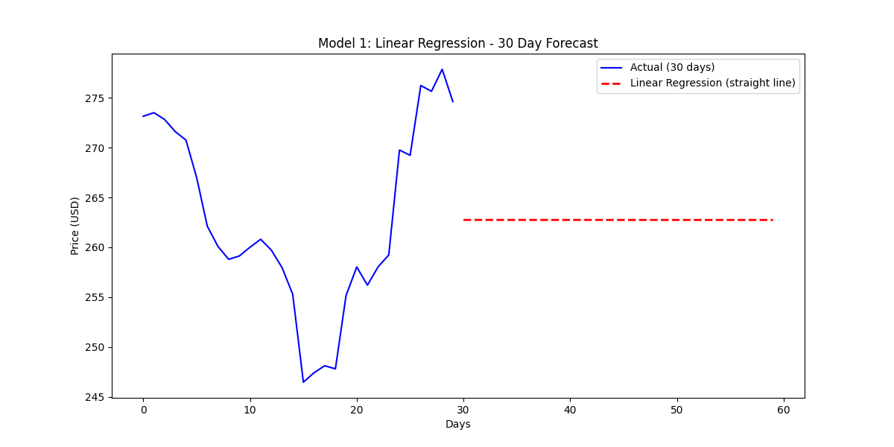
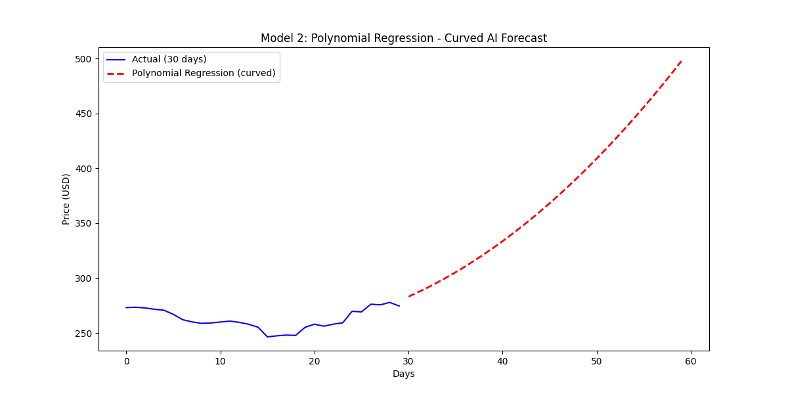
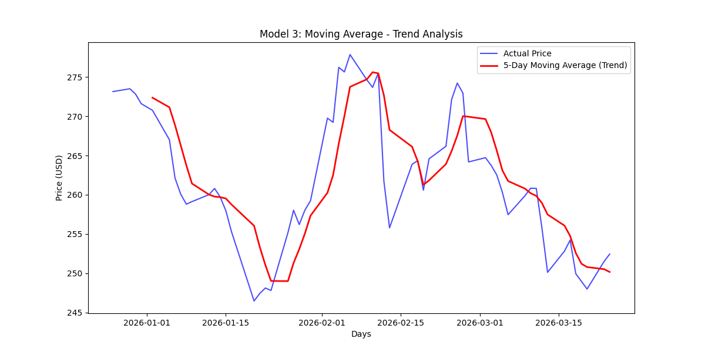

# Stock Price Prediction Models

A financial forecasting project comparing three different approaches to stock price analysis and prediction of Apple stock prices.

---

## Project Overview

This project explores how different regression models can be used to analyze and forecast stock prices. I built three models to compare their approaches and understand their strengths and limitations, from a simple baseline to a curved AI model to a real-world trading indicator.

---

## Models Included

### Model 1: Linear Regression
- **Approach:** Straight-line trend fitting
- **Purpose:** Provides a baseline for comparison

---

### Model 2: Polynomial Regression
- **Approach:** Degree 2 polynomial
- **Purpose:** Captures momentum changes and non-linear patterns

---

### Model 3: Moving Average (Trading Indicator)
- **Approach:** 5-day rolling average
- **Purpose:** Smooths out daily price volatility

---

## Key Insights

| Model | Strength | Limitation |
|-------|----------|------------|
| Linear Regression | Simple, easy to interpret | Can't capture curves or momentum shifts |
| Polynomial Regression | Captures curved trends | Higher degrees risk overfitting |
| Moving Average | Industry standard, widely used | Lagging indicator as it reacts after price moves |

---

## Data Source

All models use **Apple (AAPL)** stock data pulled from Yahoo Finance using the `yfinance` library.

- **Time period:** Last 60 trading days
- **Data point:** Closing price (the standard for stock analysis)

---

## Tools Used

| Tool | Purpose |
|------|---------|
| Python | Core programming |
| yfinance | Stock data extraction |
| pandas | Data manipulation |
| matplotlib | Visualization |
| scikit-learn | Machine learning models |

---

